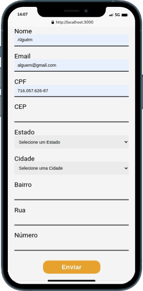

<h1 align="center">Form Hook Form</h1>
<h4 align="center">A ReactJs form validation using React Hook Form, Yup and fetch APIs</h4>

<p align="center">
  
  
  
  
  
</p>

<p align="center">
    
</p>

## About this project  
This project is part of my personal portfolio.  

## Why?
The purpose of this project was to learn form validation using **react-hook-form**, **yup** libs and also **fetch APIs**

## How to use
To clone and run this project, you'll need **[Git](https://git-scm.com)**, **[node v14.19.1](https://nodejs.org/en/)** or higher + **[yarn v1.22.15](https://yarnpkg.com)** or higher installed on your computer. From your command line:
```bash
#Clone this repository
$ git clone https://github.com/RenanTRS/form-hook-form.git

#Go into the repository
$ cd formhookform

#Install dependencies
$ yarn 

#Run
$ yarn dev
```

## Built with  
- [Vite](https://vitejs.dev/guide/#scaffolding-your-first-vite-project)
- [ReactJs](https://reactjs.org/)
- [TypeScript](https://www.typescriptlang.org/)
- [styled-components](https://www.styled-components.com/)
- [react-hook-form v7](https://react-hook-form.com/)
- [yup](https://github.com/jquense/yup)
- [validations-br](https://openbase.com/js/validations-br/documentation)
- [axios](https://axios-http.com/docs/intro)
- [viacep API](https://viacep.com.br/)
- [ibge API](https://servicodados.ibge.gov.br/api/docs/localidades)

## Contact
- Email me - renantrsouza@gmail.com  
- Connect with me on [LinkedIn](https://www.linkedin.com/in/renantrsouza/)

## License
This project is licensed under the MIT License - see the [LICENSE](https://github.com/renantrs/form-hook-form/blob/main/LICENSE) file for details.